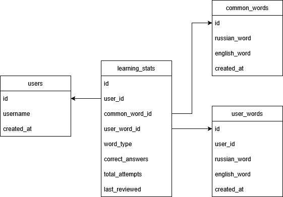

# 📚 EnglishCard - приложение для изучения английского
### Требуется Python 3.10+
## Установка
1.  **Откройте удобную для вас папку и запустите в нём cmd или PowerShell** 
2.  **Клонируйте репозиторий введя следующую команду:**
    ```bash
    git clone git@github.com:nyurgustan23-gif/EnglishCard.git
    ```
3. **Установите зависимости:**
    ```bash
    pip install --upgrade pip
    pip install -r requirements.txt
    ```
## Настройка
1. **Скопируйте файл ".env.example" и переименуйте его в ".env"**
2. **Заполните своими данными вместо шаблонов**
## Запуск
1. **Запустите приложение введя следующую команду:**
    ```bash
    streamlit run main.py
    ```
***
## Схема БД
